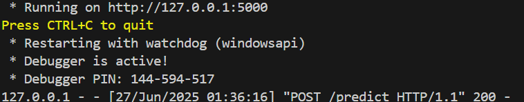
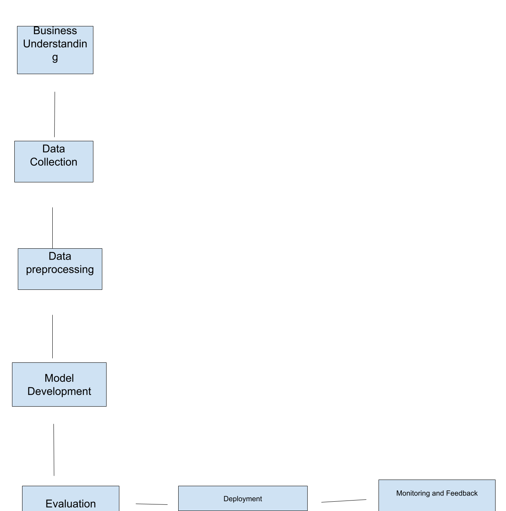

# 🧠 AI Workflow Assignment – Patient Readmission Prediction

This project applies the AI development workflow to a real-world healthcare scenario: predicting whether a patient will be readmitted within 30 days after discharge. It follows the full pipeline from problem definition to deployment and reflection, aligned with the CRISP-DM framework.

---

## 📌 Project Overview

### 🎯 Problem Statement:
A hospital aims to reduce patient readmission by predicting which discharged patients are at high risk of returning within 30 days.

### 🛠 Solution:
A machine learning model is built using structured data and deployed via a Flask API. The workflow includes data preprocessing, model training, evaluation, deployment, and ethical considerations.

---

## 📂 Project Contents

| File / Folder       | Description                                       |
|---------------------|---------------------------------------------------|
| `app.py`            | Flask API for model deployment                    |
| `test_api.py`       | Script to test the deployed API                   |
| `model.pkl`         | Trained machine learning model                    |
| `diagram.png`       | Workflow diagram (Part 4)                         |
| `report.pdf`        | Full assignment (Parts 1 to 4)                    |
| `README.md`         | This documentation file                          |

---

## 📕 Assignment Breakdown

### ✅ Part 1: Short Answer Questions
- Defined a hypothetical AI problem
- Listed objectives, stakeholders, and KPIs
- Outlined data sources, preprocessing steps, and evaluation metrics

### ✅ Part 2: Case Study (Hospital Readmission)
- Applied the workflow to a real scenario
- Discussed ethical concerns and data strategy
- Trained a logistic regression model
- Deployed the model using Flask and tested the API
  

  
   

### ✅ Part 3: Critical Thinking
- Discussed data bias and mitigation
- Analyzed interpretability vs. accuracy in healthcare
- Addressed resource constraints and trade-offs

### ✅ Part 4: Reflection & Workflow Diagram
- Reflected on challenges and improvements
- Illustrated the AI development workflow using a clear flowchart

